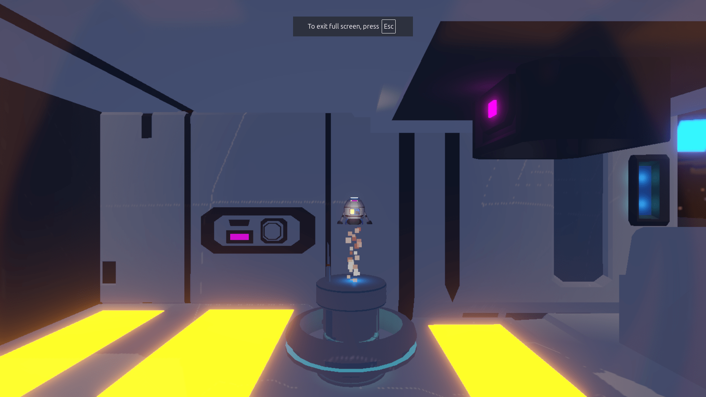
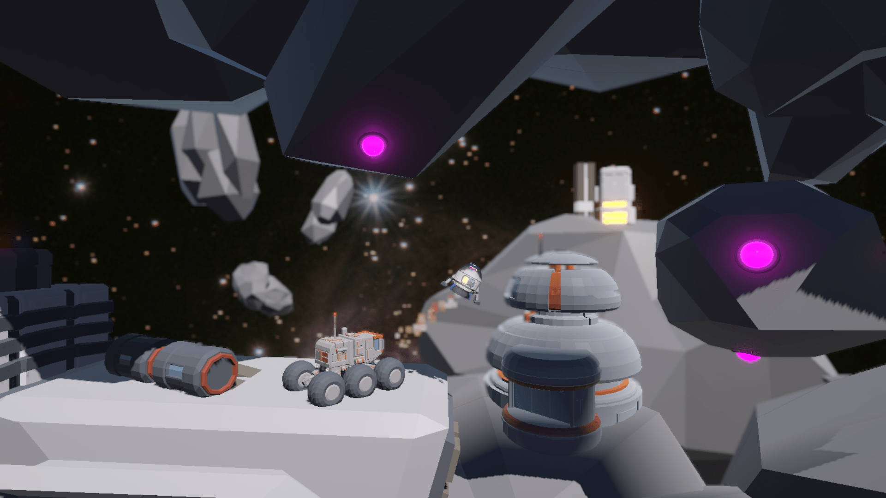
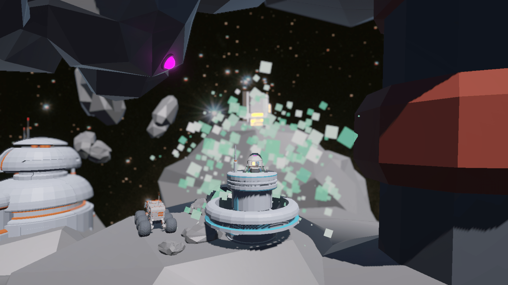

## 🚀 Rocket Boost
A simple, physics-based side-scrolling game built in Unity as part of the GameDev.tv course.

Guide your rocket through hazards, avoiding obstacles and trying to reach the finish line! Featuring basic physics, collision detection, and hand-crafted level design.

### 🎮 Controls
W / Up Arrow: Boost (apply thrust)

A / Left Arrow: Rotate Left

D / Right Arrow: Rotate Right

✅ Play it here:
Play Rocket Boost on GitHub Pages: (Go fullscreen!) [https://offroadcodemode.github.io/unity_rocket_boost/](https://offroadcodemode.github.io/unity_rocket_boost/)

### 📸 Screenshots
  

### ⚙️ Features
Physics-based movement

Collision detection with friendly and hazardous objects

Level progression system up to level 3 which I didn't quite finish.

Custom level design

### 🛠️ Tech Stack
Engine: Unity

Language: C#

📚 Credits
Developed by: Nomad Joe

Course: Complete C# Unity Game Developer 3D (GameDev.tv)

Note: Game assets were provided by the course instructors, but we had free reign on how to use them.
